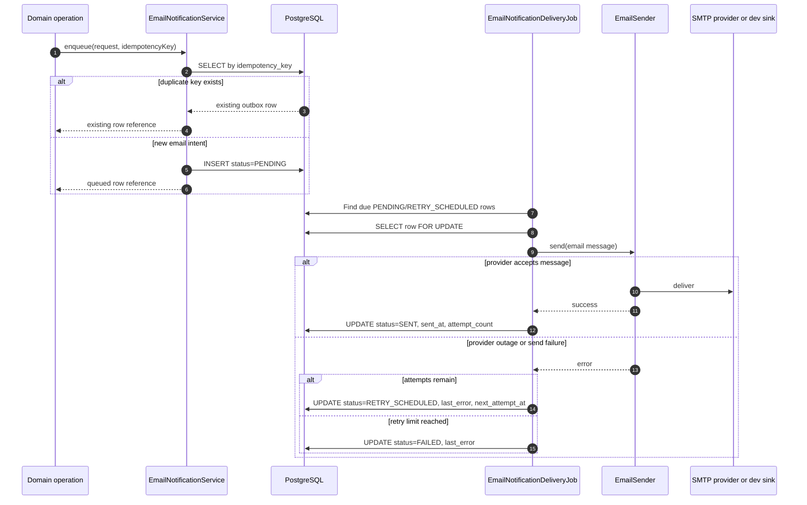

# Email Notification Outbox

**Type**: Sequence
**Last Updated**: 2026-06-13
**Status**: current

## Purpose

Explain how email intents are enqueued without inline SMTP calls, then delivered
asynchronously with idempotency, retry, and degraded behavior.

## Diagram

## Notes

- Domain operations do not call SMTP directly.
- `idempotency_key` represents the business event, not a transport attempt.
- SMTP/provider failures are captured on the outbox row and do not roll back the
  originating domain operation.
- Logs avoid raw recipient addresses and email body content.
