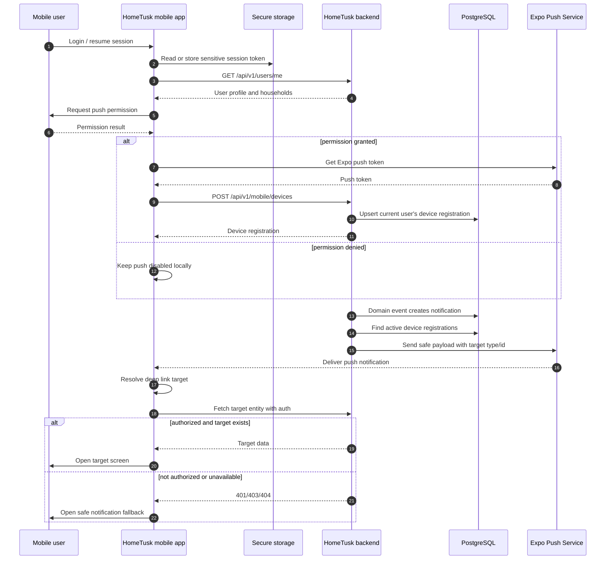

# Mobile Push And Deep Link Handoff

**Type**: Sequence
**Last Updated**: 2026-06-14
**Status**: current

## Purpose

Explain how the native mobile app registers a push token, how HomeTusk backend
keeps the device registration as the source of truth, and how a push/deep link
routes into the app without treating mobile routing as authorization.

## Diagram

## Notes

- Push payloads are hints, not source-of-truth domain data.
- Backend authorization is required when the app loads any deep-link target.
- Device token values must not be logged.
- Logout or token rotation deactivates/updates the backend device registration.
- Direct FCM/APNs can replace Expo Push Service later behind the backend sender boundary.
