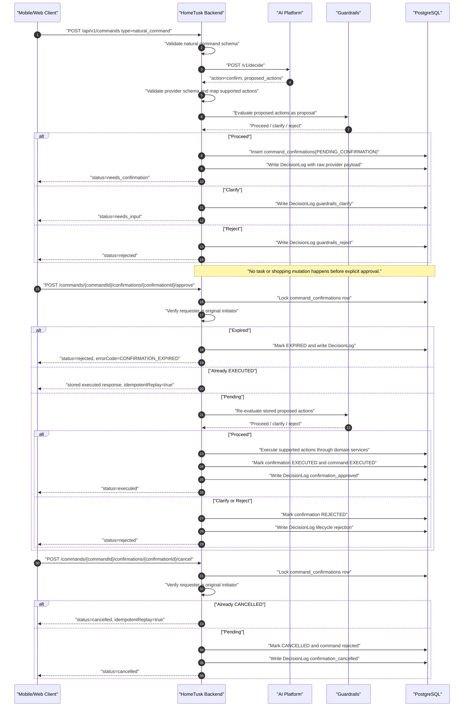

# Natural Command Needs Confirmation Sequence

```mermaid
sequenceDiagram
    autonumber
    participant Client as "Mobile/Web Client"
    participant HT as "HomeTusk Backend"
    participant AI as "AI Platform"
    participant Guardrails as "Guardrails"
    participant DB as "PostgreSQL"

    Client->>HT: "POST /api/v1/commands type=natural_command"
    HT->>HT: "Validate natural command schema"
    HT->>AI: "POST /v1/decide"
    AI-->>HT: "action=confirm, proposed_actions"
    HT->>HT: "Validate provider schema and map supported actions"
    HT->>Guardrails: "Evaluate proposed actions as proposal"
    Guardrails-->>HT: "Proceed / clarify / reject"
    alt "Proceed"
        HT->>DB: "Insert command_confirmations(PENDING_CONFIRMATION)"
        HT->>DB: "Write DecisionLog with raw provider payload"
        HT-->>Client: "status=needs_confirmation"
    else "Clarify"
        HT->>DB: "Write DecisionLog guardrails_clarify"
        HT-->>Client: "status=needs_input"
    else "Reject"
        HT->>DB: "Write DecisionLog guardrails_reject"
        HT-->>Client: "status=rejected"
    end

    Note over HT,DB: "No task or shopping mutation happens before explicit approval."

    Client->>HT: "POST /commands/{commandId}/confirmations/{confirmationId}/approve"
    HT->>DB: "Lock command_confirmations row"
    HT->>HT: "Verify requester is original initiator"
    alt "Expired"
        HT->>DB: "Mark EXPIRED and write DecisionLog"
        HT-->>Client: "status=rejected, errorCode=CONFIRMATION_EXPIRED"
    else "Already EXECUTED"
        HT-->>Client: "stored executed response, idempotentReplay=true"
    else "Pending"
        HT->>Guardrails: "Re-evaluate stored proposed actions"
        Guardrails-->>HT: "Proceed / clarify / reject"
        alt "Proceed"
            HT->>DB: "Execute supported actions through domain services"
            HT->>DB: "Mark confirmation EXECUTED and command EXECUTED"
            HT->>DB: "Write DecisionLog confirmation_approved"
            HT-->>Client: "status=executed"
        else "Clarify or Reject"
            HT->>DB: "Mark confirmation REJECTED"
            HT->>DB: "Write DecisionLog lifecycle rejection"
            HT-->>Client: "status=rejected"
        end
    end

    Client->>HT: "POST /commands/{commandId}/confirmations/{confirmationId}/cancel"
    HT->>DB: "Lock command_confirmations row"
    HT->>HT: "Verify requester is original initiator"
    alt "Already CANCELLED"
        HT-->>Client: "status=cancelled, idempotentReplay=true"
    else "Pending"
        HT->>DB: "Mark CANCELLED and command rejected"
        HT->>DB: "Write DecisionLog confirmation_cancelled"
        HT-->>Client: "status=cancelled"
    end
```
