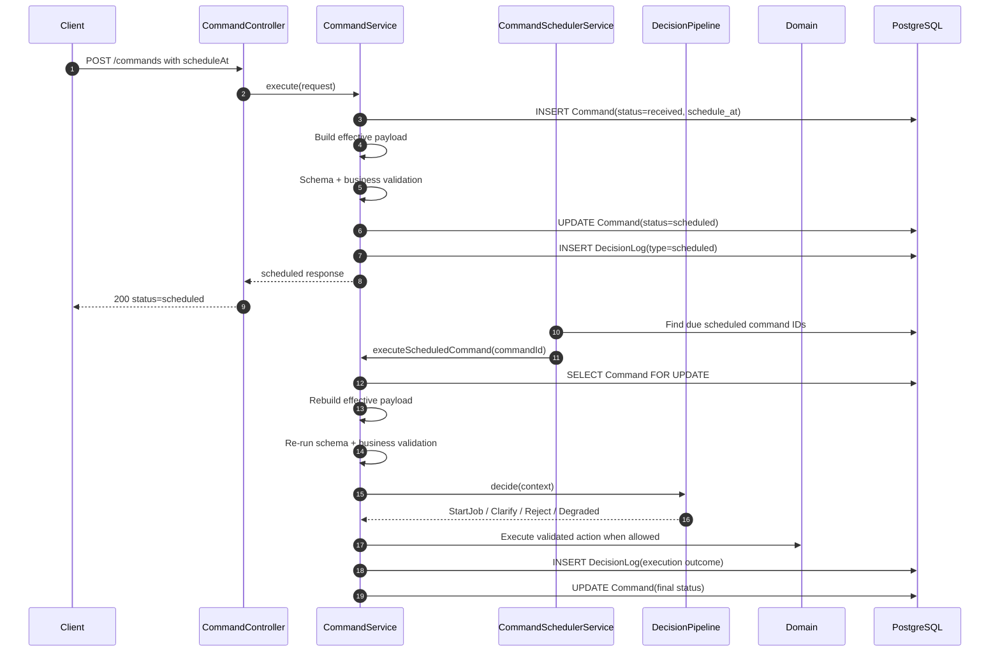

# Scheduled Command Execution

**Type**: Sequence
**Last Updated**: 2026-06-13
**Status**: current

## Purpose

Explain how `scheduleAt` commands move from accepted command submission to later
validated execution while preserving DecisionLog traceability.

## Diagram

## Notes

- Submission and due-time execution are separate decisions in the audit trail.
- Due-time validation intentionally re-checks mutable household and task state.
- Scheduler outage does not lose commands; due commands remain queryable by
  `status=scheduled` and `schedule_at <= now`.
