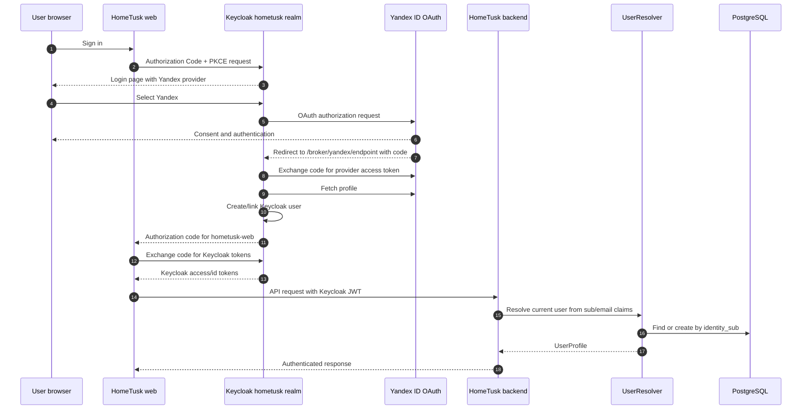

# Social Auth Through Keycloak Broker

**Type**: Sequence
**Last Updated**: 2026-06-13
**Status**: current

## Purpose

Explain how browser social sign-in stays inside Keycloak identity brokering
while HomeTusk backend consumes only Keycloak-issued JWTs.

## Diagram

## Notes

- HomeTusk backend never receives Yandex or VK provider tokens.
- User identity is Keycloak `sub`; email is profile state, not a merge key.
- Yandex is configured with `trustEmail=false`, so email notification
  eligibility still requires explicit verified state from the Keycloak JWT.
- VK ID remains a documented compatibility gap on the current Keycloak 23
  provider release.
