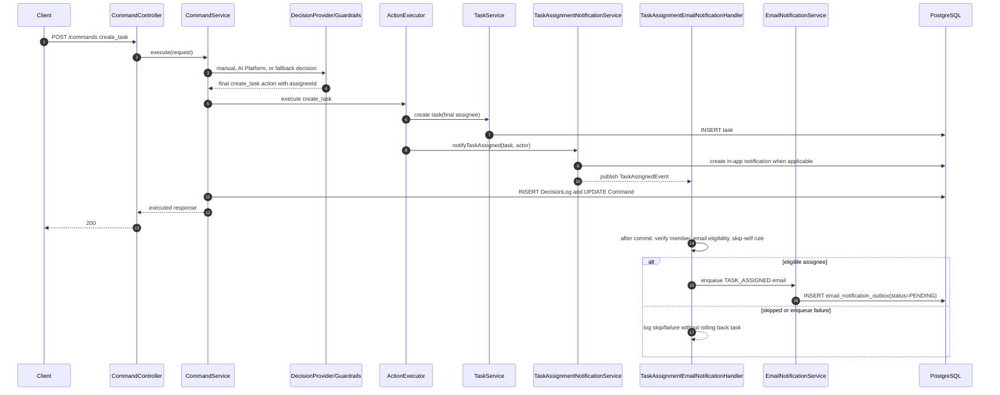

# Task Assignment Email Notification

**Type**: Sequence
**Last Updated**: 2026-06-13
**Status**: current

## Purpose

Explain how manual command, AI Platform, and guardrails-modified task assignment
paths converge on one `TaskAssignedEvent`, then enqueue email through the email
outbox without direct SMTP calls from task execution.

## Diagram

## Notes

- The email is queued for the final assignee after manual decision, AI Platform
  decision, and guardrails modifications are applied.
- Missing, unverified, non-member, or self assignments do not enqueue email.
- Email enqueue uses a task assignment idempotency key and never sends SMTP
  directly from command or task execution.
- If email enqueue fails after task assignment commits, the failure is logged and
  the task assignment remains successful.
