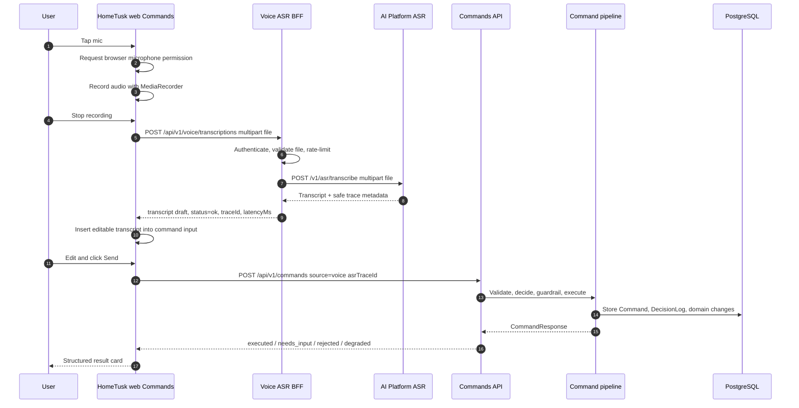

# Voice Command Chat

**Type**: Sequence
**Last Updated**: 2026-06-14
**Status**: current

## Purpose

Explain how a voice recording becomes an editable transcript draft and then a
normal HomeTusk command only after explicit user Send.

## Diagram

## Notes

- ASR BFF never calls the Commands API.
- Browser never calls AI Platform directly.
- Raw audio is not persisted.
- Raw transcript is not logged by the ASR flow.
- `asrTraceId` is safe metadata for linking the draft to a command audit trail.
