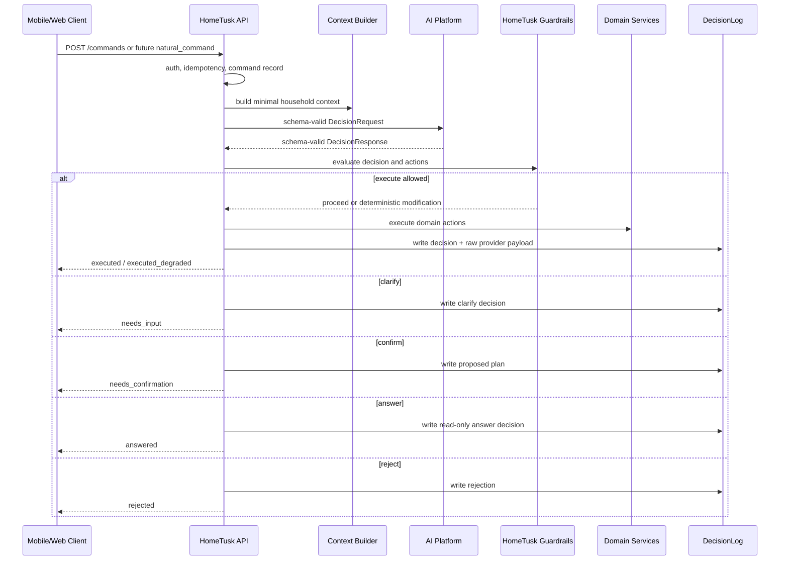

# Target Architecture v0

Status: Proposed

## Sources of Truth

- `docs/planning/strategy/product-goal.md`
- `docs/planning/initiatives/INIT-2026Q3-ai-command-capability-audit.md`
- `docs/contracts/http/commands.openapi.yaml`
- `docs/contracts/external/ai-platform.decision.openapi.yaml`
- `docs/integration/ai-platform/v1/**`
- `services/backend/src/main/java/com/hometusk/commands/**`
- `../../VR_AI_Platform/docs/adr/ADR-000-ai-platform-intent-decision-engine.md`
- `../../VR_AI_Platform/docs/adr/ADR-004-partial-trust-corridor.md`

## Design Principles

1. HomeTusk remains source of truth and execution authority.
2. AI Platform remains stateless planner/decision provider.
3. Mobile and web never call AI Platform directly.
4. AI output is schema-validated before use.
5. Guardrails and domain invariants run before execution.
6. Confidence is audit signal, not permission.
7. `clarify` and `confirm` are preferred over guessing.
8. Every command is traceable through `Command`, `DecisionLog`, provider
   decision id, and correlation id.

## Proposed Flow



## Trust Corridor v0

Allowed auto-execute:

- simple `create_task`;
- one or more `add_shopping_item` actions;
- only when all entities are grounded or safely defaulted;
- only when HomeTusk guardrails pass.

Clarify:

- vague household prep;
- ambiguous task/list/zone/member;
- missing default shopping list;
- date/time cannot be normalized safely.

Confirm:

- inferred non-requester assignment;
- task plus shopping linkage;
- reschedule;
- batch planning;
- broad workload redistribution;
- any action outside the narrow corridor but inside product domain.

Reject:

- unsafe or impossible requests;
- unsupported action types;
- cross-household references;
- unverifiable context;
- direct AI execution bypassing HomeTusk.

Answer:

- read-only household status after answer contract is accepted.

## Data Boundary

HomeTusk may send to AI Platform:

- command id;
- requester id;
- text command;
- allowed capabilities;
- household id;
- member ids/display names/roles/workload score as allowed by contract;
- zone ids/names;
- shopping list ids/names;
- deterministic defaults.

HomeTusk should not send unless explicitly approved:

- emails;
- auth tokens;
- invite tokens;
- notification payloads;
- private comments;
- raw audio;
- unrelated task history;
- cross-household data.

## Contract Shape Direction

Future provider response should map cleanly to:

```text
decision_outcome:
  execute | clarify | confirm | reject | answer
actions:
  create_task
  add_shopping_items
  complete_task
  link_task_shopping
  reschedule_task
answer:
  summary
  referenced_entities
  source_read_model
audit:
  confidence
  alternatives
  trace_id
  decision_version
```

This is not an implementation contract yet. It is the direction for artifact
gate work.

## HomeTusk Runtime Responsibilities

- Persist command lifecycle.
- Validate request schema.
- Enforce auth and membership.
- Build privacy-minimized context.
- Validate AI response schema.
- Map provider output into internal decision taxonomy.
- Enforce guardrails and business invariants.
- Execute domain services transactionally where possible.
- Record `DecisionLog`.
- Return controlled UX state to client.

## AI Platform Responsibilities

- Classify intent.
- Extract and normalize entities.
- Produce schema-valid decision.
- Prefer clarify/confirm over guessing.
- Keep to capabilities allowlist.
- Provide trace id and decision version.
- Support golden scenario regression.
- Avoid product-state mutation.

## Mobile UX Responsibilities

- Capture typed or voice transcript.
- Let user edit before send.
- Render controlled outcomes.
- Render clarification forms/chips.
- Render confirmation cards only after backend contract exists.
- Never call AI Platform directly.
- Never treat ASR transcript as execution permission.

## Observability Requirements

Minimum:

- command id;
- correlation id;
- provider decision id;
- provider trace id where available;
- decision source;
- decision outcome;
- action count and action types;
- guardrail outcomes;
- degraded reason;
- schema/business validation flags.

Do not log:

- raw audio;
- secrets;
- cross-household data;
- provider raw payload outside `DecisionLog.rawDecisionPayload`.
